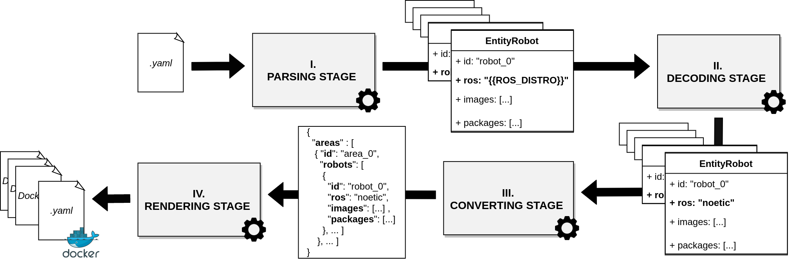

# **Enlil**

[](https://github.com/MisterOwlPT/enlil/actions/workflows/ci.yml) [](https://badge.fury.io/py/enlil) [](https://codecov.io/github/MisterOwlPT/enlil?branch=main)

Enlil is a solution to ease and speed up the containerization of entire robotic infrastructures with _ROS_.
Enlil does so by automatically generating all files required by _Docker Compose_ in order to both containerize and simultaneously orchestrate multiple _ROS_ workspaces.
All the files generated by Enlil are ready-to-use.

It is named after the sumerian God of air and **cloud**.

## **Table of Contents**
- [**Enlil**](#enlil)
  - [**Table of Contents**](#table-of-contents)
  - [**Features**](#features)
  - [**Technologies**](#technologies)
  - [**Installation**](#installation)
    - [**Manual Installation**](#manual-installation)
    - [**Pip Installation**](#pip-installation)
  - [**CLI Usage**](#cli-usage)
  - [**Generation Pipeline**](#generation-pipeline)
  - [**Template Variables**](#template-variables)
  - [**Syntax Documentation**](#syntax-documentation)
    - [**Areas**](#areas)
    - [**Robots**](#robots)
    - [**Images**](#images)
    - [**Packages**](#packages)
    - [**Globals**](#globals)
  - [**Project Structure**](#project-structure)
  - [**Articles**](#articles)
  - [**License**](#license)

## **Features**

- Converts _YAML_ files into complete and ready-to-use _Dockerfile_ and _Docker Compose_ files.
- Generates containerized ROS packages on-the-fly.
- Support for simultaneous usage of multiple ROS distributions and versions. 
- Supports usage of private code bases.
- Full support of existing _Docker Compose_ syntax.
- Completely open-source.

## **Technologies**

Enlil is completely written in _Python 3_.
It depends solely on the following external modules:

- [Docopt](http://docopt.org/) - to generate with ease a command line interface.
- [Jinja2](https://jinja.palletsprojects.com/en/3.0.x/) - to generate all output files.
- [Pip3](https://pypi.org/project/pip/) - package-management system for module installation.

## **Installation**

### **Manual Installation**

Install the dependencies running the following command:

```sh
git clone https://gitlab.inesctec.pt/pedro.m.melo/enlil
cd enlil
pip3 install -r requirements.txt
```

> In case of manual installtion it is recommended to create an *alias* for Enlil for ease of usage with:
> ```sh 
> echo 'alias enlil="python3 <PATH_TO_ENLIL>/enlil.py"' >> ~/.bashrc
> . ~/.bashrc
> ```

You may now be able to run Enlil with:

```sh
enlil <ARGUMENTS>
```
### **Pip Installation**

You can install Enlil directly through _pip_:

```sh
pip3 install enlil
```

You may now be able to run Enlil with:

```sh
enlil <ARGUMENTS>
```
## **CLI Usage**

Enlil has a command line interface, that expects the following arguments:


| CLI ARGUMENT       	| DESCRIPTION                                    	| REQUIRED 	|
|--------------------	|------------------------------------------------	|----------	|
| ```configuration_file``` 	| the input _YAML_ configuration file            	| Yes      	|
| ```output_file```        	| path and name for final _Docker Compose_ file  	| No       	|

> If not specified, the CLI argument *output_file* creates a file *docker_compose.yml* on the same folder where Enlil is execited.

For more information about usage the following command can be executed:

```sh
enlil -h
```

Enlil must be provided an _YAML_ configuration file (CLI argument ```configuration_file```) as shown:

```yaml
---
areas:
  - id: IILAB-fasten
    robots:
      - friday

robots:
  - id: friday
    ros: melodic
    images:
      - ros-development
    packages:
      - rosbridge
      - universal_robot
    vars:
      - UR_VERSION: 10
      - ROSBRIDGE_PORT: 9091

images:
  - id: ros-development
    image: ros
    stdin_open: true
    tty: true
    volumes:
      - ./ros_workspace:/ros_workspace

packages:
  - id: universal_robot
    path: ./packages/
    git:
      - https://github.com/ros-industrial/universal_robot:{{ROBOT_ROS_DISTRO}}-devel
    command: "roslaunch ur_gazebo ur{{UR_VERSION}}.launch gui:=false"

  - id: rosbridge
    path: ./packages/
    apt:
      - ros-{{ROBOT_ROS_DISTRO}}-rosbridge-server
      - ros-{{ROBOT_ROS_DISTRO}}-tf
    ports:
      - "{{ROSBRIDGE_PORT}}:{{ROSBRIDGE_PORT}}"
    command: "roslaunch rosbridge_server rosbridge_websocket.launch port:={{ROSBRIDGE_PORT}}"

globals:
  - id: webviz
    image: cruise/webviz
    ports:
      - "8081:8080"
```


## **Generation Pipeline**

Enlil divides input data into *five distinct types* of **entities**:

- **Area**: each *area* represents a physical space where multiple robots may work simultaneously.

- **Robot**: each *robot* represents a robotic agent running *ROS* and performing some action inside a given area. 

- **Image**: each *image* represents **an existing** _Docker_ image that is part of the _ROS_ stack running inside the robot.

- **Package**: each *package* represents, in oposition to _images_, a *ROS* node that is still **to be containerized**. The required *Dockerfile* for such _ROS_ nodes are generated alongside the final *Docker Compose* file.

- **Global (Entity)**: each *global* consists of an existing _Docker_ image that is relevant to the infrastructure and that may or may not interact with the _ROS_ nodes.

The pipeline adopted by Enlil to generate the final _Docker Compose_ file and _Dockerfile_ is show in the next picture.



The pipeline is composed of the following stages:

- **Parsing Stage (I)**: responsible for the parsing of the input file and initialization of typed _entities_.

- **Decoding Stage (II)**: responsible for the decoding of template variables, as explained in detail in the next section.

- **Converting Stage (III)**: responsible for transforming the decoded data into a more useful format for rendering.

- **Rendering Stage (IV)**: responsible for generating the final _Docker Compose_ file and all required _Dockerfiles_.

## **Template Variables**

Enlil emphasizes reusage of code having an inner templating mechanism.

**All textual information placed in between curly braces is interpreted by Enlil to be a template variable**. Similar to variables in a programming language, template variables work as placeholders for useful information. They are a powerful tool to hide complexity allowing developers to describe more complex scenarios with less effort by reutilizing a same _package_ or _image_ declaration multiple times within multiple robots.

There are two types of template variables:
- the variables *defined by developers* at the configuration file level. These variables may also be used be developers.
- the variables *set automatically* by Enlil and that are used internally.

| DEFAULT TEMPLATE VARIABLE 	| LEVEL 	| DESCRIPTION                                                                                                                                         	|
|---------------------------	|-------	|-----------------------------------------------------------------------------------------------------------------------------------------------------	|
| ```{{ AREA_ID }}```             	| Area  	| the _area_'s unique identifier                                                                                                                      	|
| ```{{ ROBOT_ID }}```            	| Robot 	| the _robot_'s unique identifier                                                                                                                     	|
| ```{{ ROBOT_ROS_DISTRO }}```    	| Robot 	| the _ROS_ distribution associated with the _robot_                                                                                                  	|
| ```{{ ROBOT_ROS_METADATA }}```  	| Robot 	| either the port number for the _ROS master node_ (_ROS_ distributions) or the value of environment variable _ROS_DOMAIN_ID_ (_ROS2_ distributions)  	|

As shown in the next section, developers can define their own template variables developers by means of the field **vars**.

The decoding of template variables into real information is performed at the second stage of the presented pipeline. 
The decoding stage takes advantage of the hierarchy existent between the different types of entities. Starting with all entities of type *area* the proposed solution analyzes all data about the *robots* within a single area. Then, it individually analyzes the data of each *image* within each robot. The same is done for every *package* within the robot. This way, information can be passed from entities of type _area_ to entities of type _robot_, and from these to entities of types _image_ and _package_.

> As a suggestion, developers may combine Enlil's template variables with Docker Compose's template variables ( enclosed in between ${...} ) to obtain an even higher degree of code reusage.

## **Syntax Documentation**

Enlil expects the input _YAML_ configuration file to be divided into the following five sections: ```areas```, ```robots```, ```images```, ```packages``` and ```globals```. Each of these sections contains data about the respective typed _entities_ and is also expected to follow a specific syntax, as explained in detail in this section. Enlil returns a proper error anytime a section does not comply with the said syntax. 

Always keep in mind that **the syntax adopted by Enlil is fully compliant with the syntax employed by *Docker Compose*.**
Enlil will only take into consideration the fields specified below. Therefore, any extra fields declared within sections ```images``` and ```packages``` will be passed to the final _Docker Compose_ file. This feature allows you to to declare, for example, _Docker_ volumes and _Docker_ networks just as you would normally while using regular _Docker_ tools. In spite of not being used directly by Enlil, all information declared within the said sections goes through the entire generation pipeline and may take advantages of the already explained template variables.

### **Areas**

> This section is mandatory for all input files!

| FIELD  	| DESCRIPTION                                                                              	| REQUIRED 	|
|--------	|------------------------------------------------------------------------------------------	|----------	|
| ```id```     	| the _area_'s unique identifier                                                           	| yes      	|
| ```robots``` 	| a list containing  the unique identifiers of all the robots operating within the  _area_ 	| yes      	|

Important considerations:

- Each area has a private network associated to it, to which all its robots are connected and may use to communicate.
- All areas are required to have at least one robot.

### **Robots**

> This section is mandatory for all input files!

| FIELD    	| DESCRIPTION                                                                                                                	| REQUIRED                                     	|
|----------	|----------------------------------------------------------------------------------------------------------------------------	|----------------------------------------------	|
| ```id```       	| the _robot_'s unique identifier                                                                                            	| yes                                          	|
| ```images```   	| a list containing the unique identifiers of all the existing _Docker_ images to be run within the robot                    	| yes (but only if _packages_ is not declared) 	|
| ```packages``` 	| a list containing the unique identifiers of all the _Docker_ container to be generated on-the-fly and run within the robot 	| yes (but only if _images_ is not declared)   	|
| ```ros```      	| corresponds to the ROS distribution to be run inside the robot                                                             	| yes                                          	|
| ```vars```     	| a list of template variables associated with the robot                                                                     	| no                                           	|

Important considerations:

- All robots must be declared within an area or otherwise they will not be considered by Enlil. 

- Robots from the same area can communicate with themselves (using their area's network) while robots from different areas can't communicate between themselves at all.

- At least one of the fields ```images``` and ```packages``` must be declared.

- Field ```ros``` follows the format ```<DISTRO:MASTER>``` where ```DISTRO``` is mandatory and corresponds to the name of the desired  _ROS_ distribution and ```MASTER``` is optional and corresponds the the networking port in which the _ROS master node_ will be listening for communications. In case a _ROS2_ distribution is chosen then the value of ```MASTER``` corresponds to the desired value for environment variable ```ROS_DOMAIN_ID```. If  ```MASTER``` is ommited, then the default value of **11311** is chosen for _ROS_ distributions and the default value of **42** is chosen for _ROS2_ distributions.

- Entries in ```vars``` follow the format ```<KEY:VALUE>``` where ```KEY``` is an unique identifier for the template variable **within the robot** and ```VALUE``` is the value for the variabel itself. 

> At the moment only _ROS_ distributions ***melodic***, ***noetic*** and ***foxy*** were tested.

### **Images**

| FIELD    	| DESCRIPTION                                                                                                                	| REQUIRED                                     	|
|----------	|----------------------------------------------------------------------------------------------------------------------------	|----------------------------------------------	|
| ```id```       	| the _image_'s unique identifier                                                                                            	| yes                                          	|
| ```image```    	| the _Docker_ image to be used                                                                                              	| yes                                          	|

Important considerations:

- Field ```image``` follows the format  ```<IMAGE:TAG>``` where ```IMAGE``` is mandatory and corresponds to the name of the desired  _Docker_ image to use while ```TAG``` specifies the desired version of the specified _Docker_ image. Contrarily to the _Docker_ standard, where the default value for an image tag is ```latest```, the default value used by Enlil always matches the _ROS_ distribution of the robot where the entity is declared.

### **Packages**

| FIELD      	| DESCRIPTION                                                                       	| REQUIRED                                                     	|
|------------	|-----------------------------------------------------------------------------------	|--------------------------------------------------------------	|
| ```apt```        	| list of required software modules to be installed via the inbuilt package manager 	| yes (but only if neither _git_ or _rosinstall_ are declared) 	|
| ```command```    	| the command to be run after the _Docker_ container is initialized                 	| yes                                                          	|
| ```git```        	| list of _URL_s for required _git_ repositories                                    	| yes (but only if neither _apt_ or _rosinstall_ are declared) 	|
| ```id```         	| the _package_'s unique identifier                                                 	| yes                                                          	|
| ```path```       	| the output path for the _package_'s _Dockerfile_                                  	| yes                                                          	|
| ```rosinstall``` 	| path to a _.rosinstall_ file listing code dependencies to be installed            	| yes (but only if neither _git_ or _apt_ are declared)        	|
| ```ssh``` 	      | list of complete file paths required to install private code dependencies           | no                                                          	|

Important considerations:

- The generated _Dockerfile_ can be used freely to build and deploy customized _Docker_ images of _ROS_ nodes.

- Whenever the fields ```git``` or ```rosinstall``` are declared the creation of the final _Docker_ container is done in two stages, allowing for the secure usage of private code bases using existing _SSH deploy keys_. During the first stage the contents of the host folder ```ssh/``` are copied into the container before the downloading of any declared repository. Only the downloaded repositories are then passed to the final stage, making access to the _SSH deploy keys_ impossible through the final container or _Docker_ image.

- At least one of the fields ```apt```, ```git``` and ```rosinstall``` must be declared.

- The base _Docker_ images used are ```ros:melodic```, ```ros:noetic``` and ```ros:foxy```, all of which come with the ```apt``` package manager already installed. Check https://hub.docker.com/_/ros for more information.

### **Globals** 

Important considerations:

- All declared globals are placed by Enlil in the final _Docker Compose_ file *as is* and without any changes. **Use this section to declare everything you would otherwise declare in a normal _Docker Compose_ file.**
  
- The default values for globals match the ones used by _Docker_ and _Docker Compose_. For instance the default ```tag``` for an _Docker_ image is again ```latest```. 

- Since they are passed unaltered to the final _Docker Compose_ globals should not use template variables.

## **Project Structure**

The source code for this project is rganized as follows:
- ```docs```: contains all the information regarding documentation, both textual and images.

- ```examples```: contains example _YAML_ configuration files that serve as example for developers trying to learn how to use Enlil.

- ```pipeline```: contains the source code for the presented file generation pipeline:
  
  - ```/decoder```: contains the source code responsible for stages II and III of the presented pipeline.
  
  - ```/loader```: contains the source code responsible for stages I of the presented pipeline.
  
    - ```/entities```: contains the implementations for each type of entity. 
  
  
  - ```/renderizer```: contains the source code responsible for stages IV of the presented pipeline. 
  
    - ```/templates```: contains the templates used to generated the final _Docker Compose_ file and necessary _Dockerfiles_.
  
  
- ```tests```: contains the unit tests for the application.

- ```enlil.py```: application entry point.

## **Articles**

Enlil is featured at the [INDIN](https://www.ieee-indin.org/) conference (2021 edition).

More information about the submitted article will be placed soon. 

## **License**

Enlil is itself free, open-source and is deployed with MIT license.
